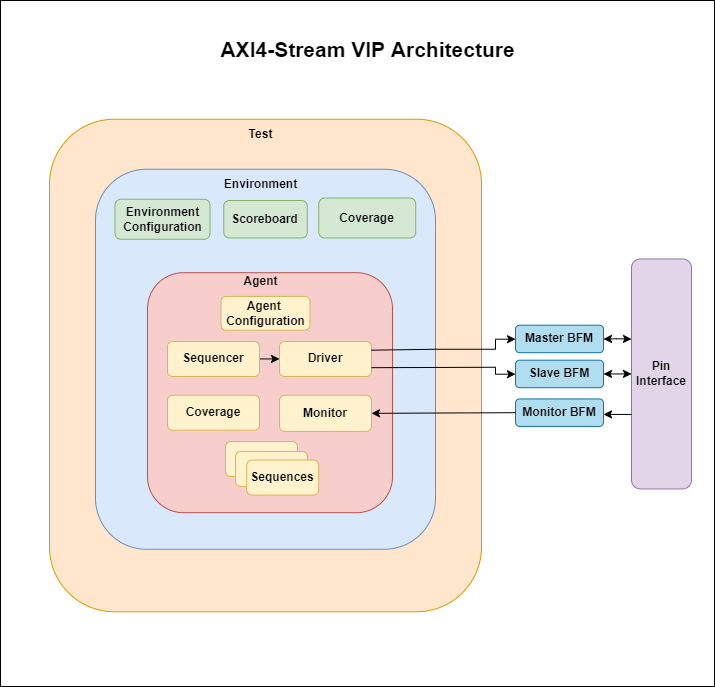

# AXI Stream Verification IP
This repo contains an UVM based AXI Stream VIP

## Diagram

## Features
- [ ] Assertion based property checking
- [ ] AXI4-Stream Pin Interface
- [ ] Standalone Bus Functional Models (independent of UVM based components)
  - [ ] Master BFM 
  - [ ] Slave BFM
  - [ ] Monitor BFM
- [ ] UVM Agent
  - [ ] Configuration
  - [ ] Driver
  - [ ] Monitor
  - [ ] Sequencer
  - [ ] Coverage collection
- [ ] UVM Sequence Item
- [ ] UVM Sequences
  - [ ] Byte stream sequence
  - [ ] Continous aligned stream sequence
  - [ ] Continous unaligned stream sequence
  - [ ] Sparse stream sequence
- [ ] UVM Environment
  - [ ] Virtual sequencer
  - [ ] Scoreboard
  - [ ] Coverage collection 